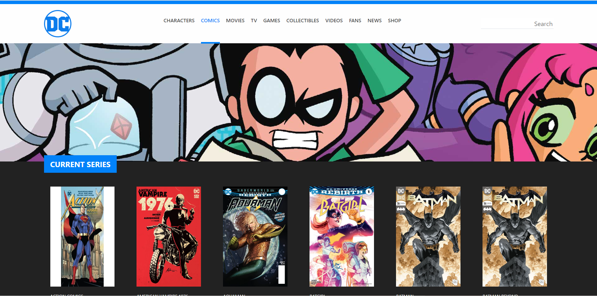

<h1><strong style="color: #EF3B2D;">9 + BOOTSTRAP TEMPLATE</strong></h1>

# Laravel Comics

> Layout dinamico con Laravel

## Tecnologie e Librerie:

-   Html
-   Css
-   Sass
-   Bootstrap
-   Php
-   Laravel

## Descrizione:

Progetto Laravel con un file di layout in cui viene inserita la struttura comune di tutte le pagine del sito web (tag head, tag body, ...) vengono inclusi poi header e footer tramite due partials.
Si crea poi una rotta per visualizzare la lista di tutti i fumetti recuperati da un file inserito nella cartella config e si abbellisce lo stile sfruttando Sass.

<!-- ## Bonus:

Creare più pagine istituzionali che condividono lo stesso layout. -->
